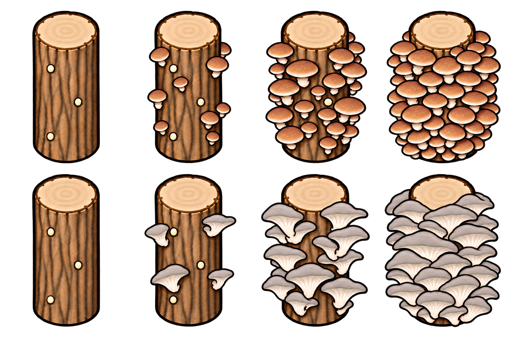
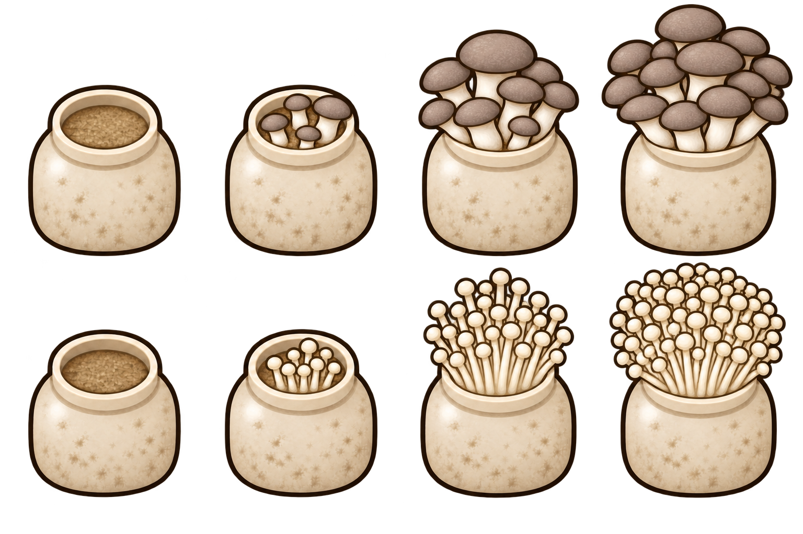

# More Mushrooms 야생 생태와 재배 시설 제안

기준 버전 v0.5.0 · 작성일 2026년 10월 10일 · 검토안

기존 재배 가능한 식용버섯의 야생 발생을 소폭 줄이고, 신규 버섯의 발견 빈도를 높인다. 전체 야생 버섯의 규모를 현재와 비슷하게 맞추면서 채집 중 다양한 종류를 발견하는 재미를 늘린다.

서식지와 날씨에 따른 발생을 바탕으로 제철·군락 모양·발광·균사 재생·채집 의뢰를 더해, 버섯마다 발견하고 채집하는 경험에 개성을 준다.

재배에는 원목 재배대와 배지 재배통을 추가해 자원을 투입하여 생산량을 늘리는 선택지를 만든다.

## 현재 상태와 조정 목표

온대림에 등록된 버섯의 생성 가중치 합계는 기존종 약 82%, 신규종 약 18%다. 신규종의 수에 비해 발견 비중이 작다. 이 비율은 설정값의 비율이며 실제 맵에서 센 개수는 아니다. [현재 식물 설정](https://github.com/Izzypizzy1218/MoreMushrooms/blob/b37fa2580cc8846a180b62d88c9f5f6b896d2af0/Defs/ThingDefs_Plants/Mushrooms.xml)

**온대림의 신규종 비중을 약 30%까지 높이는 것을 목표로 한다.** 다른 생물군계는 등장 가능한 종류와 식물 밀도를 고려해 별도로 맞춘다.

## 야생 발생 빈도 조정안

| 대상 | 현재 대비 초기 조정 범위 | 기대 효과 |
|---|---:|---|
| 기존 재배 가능한 식용버섯 | 15~20% 감소 | 익숙한 식용버섯으로 치우치는 현상 완화 |
| 신규 일반 식용 및 특이 식용 | 50~80% 증가 | 새 식용버섯을 발견할 기회 확대 |
| 신규 약용 및 관상 소재 버섯 | 80~100% 증가 | 다양한 종류를 채집하고 수집하는 재미 강화 |
| 신규 고급 식용버섯 | 30~50% 증가 | 트러플·포르치니 등의 발견 기회를 늘리되 희소성 유지 |
| 신규 치명적인 독버섯 | 0~20% 증가 | 위험한 희귀종으로서의 비중 조절 |

증감률은 야생 생성 추첨에서 각 종류가 차지하는 비중인 **가중치**에 적용한다. 실제 등장 개수는 지형·군락·종별 비율 보정 등에 따라 달라진다. 위 범위에서 시작해 전체 발생 규모와 신규종 비중을 확인하며 최종값을 정한다.

## 서식지와 비 온 뒤 군락

- **서식지별 발생:** 종류에 따라 살아 있는 나무 주변, 그루터기 인근, 흙이 드러난 땅 등 발생하기 좋은 장소를 정한다.
- **비 온 뒤 군락:** 비가 온 뒤 조건에 맞는 장소에서 작은 군락이 일시적으로 늘어나게 한다.

## 추가할 만한 요소

| 요소 | 구체적인 모습 | 기대 효과 |
|---|---|---|
| 버섯 제철 | 종류마다 야생에서 잘 발생하는 시기를 정해 계절에 따라 군락 구성이 달라짐 | 계절마다 다른 버섯을 찾아볼 이유 제공 |
| 고리 모양 군락 | 드물게 버섯이 원이나 반원 형태로 발생 | 발견했을 때 눈에 띄는 풍경 형성 |
| 실제 발광 | 발광 계열이 자라는 동안 작은 반경을 은은하게 비춤 | 밤에 발견하는 재미와 종류별 개성 강화 |
| 남아 있는 균사 자리 | 일부 일반종은 채집한 자리에서 시간이 지나면 소량 다시 발생 | 채집 장소를 기억하고 다시 방문하는 재미 제공 |
| 희귀 버섯 채집 의뢰 | 특정 버섯이나 여러 종류를 모아 납품하는 의뢰 | 희귀종을 찾을 목적과 수집 보상 제공 |

## 무전력 버섯 재배 시설

현실의 통나무 재배와 배지 블록·용기 재배를 바탕으로 다음 두 시설을 추가한다. [코넬대 재배 안내](https://smallfarms.cornell.edu/resources/methods-of-commercial-mushroom-cultivation-in-the-northeastern-united-states/4-four-methods-of-commercial-cultivation/)

| 시설 | 형태와 역할 | 일반 흙 대비 생산량 목표 | 운영 비용 |
|---|---|---:|---|
| 원목 버섯 재배대 | 받침 없이 세운 원목 1개에서 버섯이 자라는 무전력 시설 | 1.5배 | 건설 목재와 주기적인 원목 보충 |
| 배지 재배통 | 바깥 트레이 없이 배양병 1통에서 버섯이 자라는 무전력 시설 | 2배 | 건설 자원과 주기적인 배지 보충 |

배율은 **같은 면적과 같은 기간의 총생산량**을 기준으로 한다. 성장속도와 수확량에 배율을 각각 적용해 곱하는 방식은 피한다.

바닥 비옥도와 관계없이 나무바닥·콘크리트 위에도 설치할 수 있도록 설계한다. 재배 대상은 현재 재배 가능한 11종을 중심으로 시설별 적합 품종을 정하고, 목재·강철 등 기존 자원을 활용한다. 주민이 재료 보충과 수확을 자동으로 반복하도록 구성한다.

**전동 버섯 재배선반은 수경재배와 역할이 겹쳐 제외한다.** 시설 크기·건설비·보충 주기·연구 해금은 후속 검토 항목이다.

### 확정된 외형과 성장 표현

**2026년 10월 10일, 아래 그림의 외형과 성장에 따른 풍성함을 확정했다.** 한 개체는 원목 1개 또는 배양병 1통으로 표현하며, 나무 받침과 바깥 플라스틱 트레이는 두지 않는다.

원목과 병의 몸체·크기·시점은 고정한다. 심은 버섯의 품종에 따라 갓과 줄기의 모양·색이 바뀌고, 성장하면서 버섯의 크기와 군락 밀도가 함께 늘어난다.

| 성장 단계 | 표시 방식 |
|---|---|
| 빈 상태 | 버섯이 없는 원목 또는 배지를 담은 병만 표시 |
| 초기 성장 | 작은 버섯이 여러 곳에서 돋아 어린 군락을 형성 |
| 중간 성장 | 품종의 특징이 드러나는 풍부한 군락으로 성장 |
| 완전 성장 | 원목 앞면과 옆면이 거의 덮이거나 병 입구가 빈틈없이 찰 만큼 빽빽한 군락으로 표시 |

수확 후에는 빈 모습으로 돌아가며, 다음 성장에 따라 심은 품종의 버섯이 다시 나타난다. 각 단계의 정확한 성장률 구간은 후속 검토에서 정한다.

### 원목 버섯 재배 외형

위쪽은 표고, 아래쪽은 느타리의 품종별 표시 예시다. 각 행은 왼쪽부터 빈 상태 → 초기 성장 → 중간 성장 → 완전 성장 순서다. 완전히 자라면 원목의 윗절단면은 보이고, 그 아래 껍질은 겹치는 버섯 갓으로 거의 덮인다.

### 배양병 버섯 재배 외형

위쪽은 새송이, 아래쪽은 팽이의 품종별 표시 예시다. 각 행은 같은 네 성장 단계로 구성한다. 완전히 자라면 병 입구 전체가 빽빽한 버섯 군락으로 채워지고, 아래 병 몸체는 보인다.

## 추천 진행 순서

**서식지와 비 온 뒤 군락 → 발광과 고리 군락 → 제철 → 균사 재생과 채집 의뢰** 순으로 진행한다.

계절·우천 군락·고리 군락·균사 재생의 발생분을 합산해 전체 발생 규모를 맞춘다. 특정 시기와 장소에 버섯이 모이는 느낌을 살리며, 추가 요소는 자연스럽게 작동하도록 구성해 관리 작업을 줄인다.

## 조정 후 확인할 항목

- 같은 크기와 조건의 온대림을 여러 시드로 비교해 전체 버섯 수와 기존종·신규종 비중을 확인한다.
- 일반 식용은 채집할 만큼 보이고, 고급 식용과 치명적인 독버섯은 드문 발견으로 남는지 살핀다.
- 식물 하나가 차지하는 한 칸을 기준으로 집계한다. 성장 그림에 보이는 버섯 개수와 수확물 수량은 별도로 본다.
- 제철·우천 군락·균사 재생을 함께 적용했을 때의 발생량과 채집량도 확인한다.
- 재배 시설은 흙·균사자갈·수경재배와 같은 면적 및 기간의 생산량, 자원 소모, 주민 작업량을 비교한다.

## 권장 방향

**흔한 식용버섯을 조금 줄이고, 신규 버섯 중 약용·소재·특이종을 중심으로 늘린다.** 전체 버섯 수보다 발견하는 종류의 다양성을 높이는 데 우선순위를 둔다.

서식지·시기·군락 모양·발광의 차이로 버섯의 개성을 드러내고, 균사 재생과 채집 의뢰로 다시 찾아갈 이유를 만든다.

재배 시설은 원목 1.5배·배지통 2배의 생산량 목표를 기준으로 비용과 편의성을 맞춘다.
